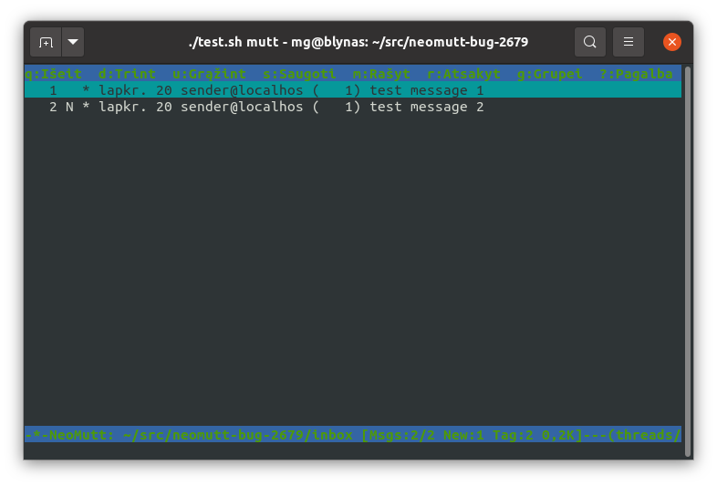
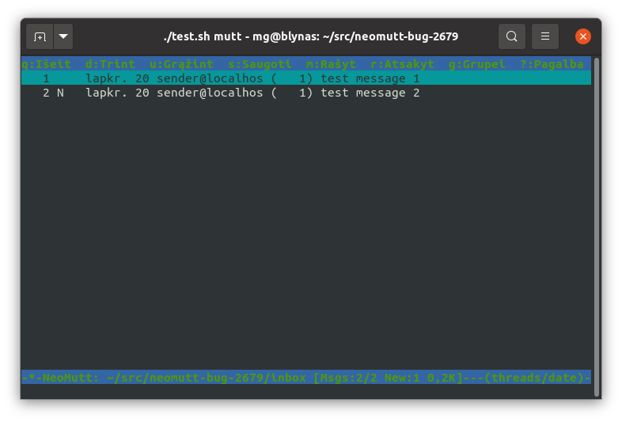

Reproduction for https://github.com/neomutt/neomutt/issues/2679

Run `./test.sh`.  You should see this (two messages tagged):

Press `;t`.  You should see this (no messages tagged):

If you see one message still tagged, you have the bug!

Press `x` to exit.
